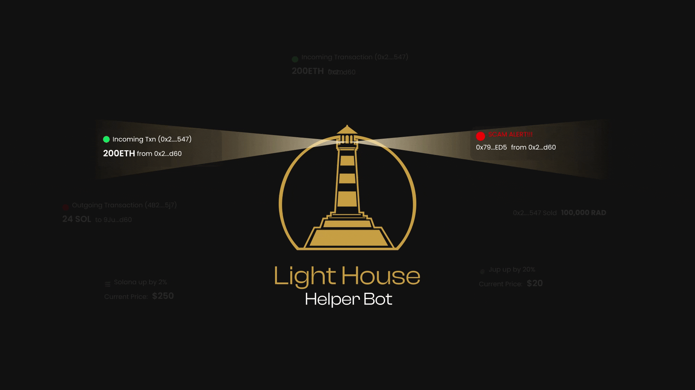

---  
title: Overview  
description: Overview of Lighthouse Helper Bot  
---  
# Overview  
Lighthouse Helper Bot is a tool that watches blockchain activities and sends notifications to you in real time. Created by Hindsight VIP, it's designed for users, traders, DAOs and crypto enthusiasts to keep track of wallet activities, token movements and NFT transactions within Discord. With fast and clear alerts, you can stay ahead of market changes, identify risks and follow important events on the blockchain.  

## What you can do with Lighthouse  
- Monitor wallets for deposits, withdrawals or specific token transfers on Ethereum, Solana and the XRP Ledger.  
- Track when a token's price changes and set alerts for when prices reach certain levels.  
- Follow NFT collections to see changes in floor prices, sales and new listings.  
- Get notifications about significant trades, staking events or contract interactions that could impact your strategies.  
- Set up personal watchlists and alerts so you only get the most important information.  
Lighthouse is flexible. You can change, pause or edit alerts at any time to make sure you only receive notifications that matter. The service currently supports Ethereum, Solana and XRPL. It plans to expand to other blockchains and will connect with Telegram, webhooks and external dashboards.  
Keep informed. Track smarter. 