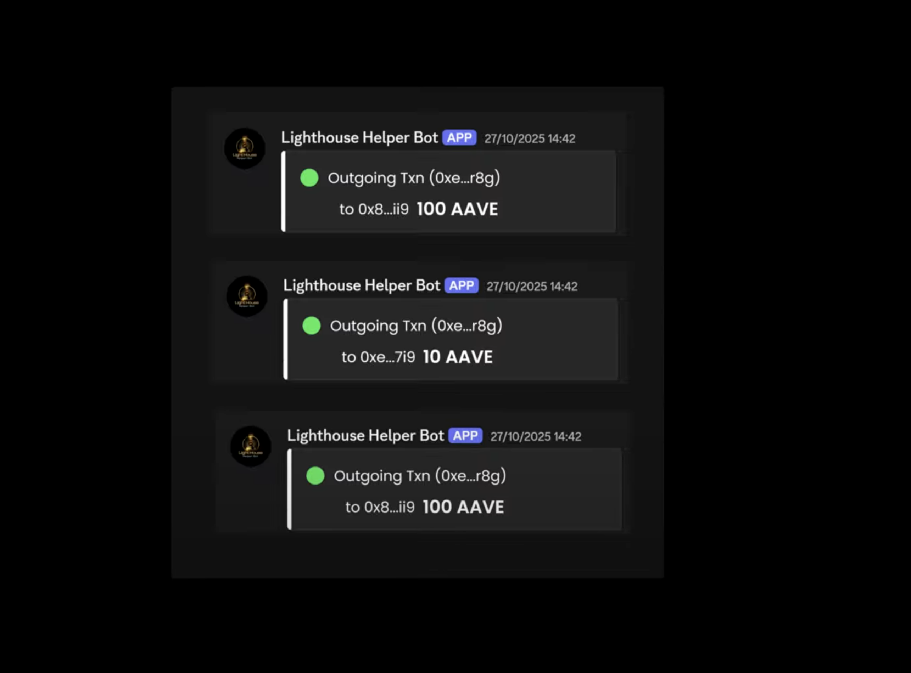

---  
title: Quick Start  
description: Guide to set up Lighthouse Helper Bot quickly.  
---  
# Quick Start  
Start using Lighthouse Helper Bot in a few simple steps and get real-time alerts.  
## Access the bot  
- Make sure you have an active Hindsight account.  
- Connect your Discord account to Hindsight VIP.  
## Join the Hindsight Discord server  
- Join the Hindsight VIP Discord Server.  
- In the welcome room, type !hindsight to initialize the bot.  
## Set wallet alerts  

- Use `/track wallet` in Discord to set alerts for deposits, withdrawals or token transfers.  
- Choose the network (ETH, SOL or XRPL) and enter the wallet address.  
- Choose the activity to track (incoming, outgoing or all).  
- Name your alert and confirm.  
## Set token or NFT alerts  
- Use `/track token` or `/track NFT collection` commands.  
- Choose network and select the token or collection.  
- Set conditions such as price changes, floor prices, sales or listings.  
- Adjust frequency and give the alert a name, then confirm.  
## Customize and manage alerts  
- Use `/watchlist` at any time to view your active alerts.  
- Pause, resume or remove alerts as needed.  
- Use inline buttons from notification messages to change alert settings quickly.  
## Monitor your stats  
- Use `/statistics` to see your personal tracking stats and usage. 